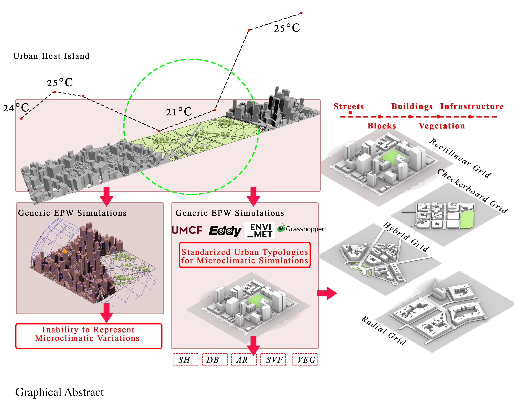

# BASELINE: Benchmarking Scenarios for Environmental Layouts and Integrative Neighbourhood Evaluation



## Abstract

Urban microclimatic analysis is essential in addressing challenges of urbanization and climate change, particularly the Urban Heat Island (UHI) effect. Urban areas often experience significantly higher temperatures than their rural surroundings due to the concentration of built surfaces and reduced vegetation. Studies estimate that UHI can increase daytime temperatures in  U.S. cities by approximately 1°C to 7°C and night-time temperatures by about 2°C to 5°C (Drukenmiller, 2024). 

This research introduces canonical urban geometries to bridge the gap between theoretical microclimatic principles and practical urban design applications. Developed through a systematic study of urban typologies, these geometries represent diverse layouts, incorporating metrics like Sky View Factor (SVF), Aspect Ratio (AR), and Vegetation Cover.

Unlike traditional EPW files, which lack the granularity required for microclimatic precision, this approach enhances simulation accuracy by integrating localized urban configurations. Canonical geometries capture critical interactions between urban form and environmental factors, enabling comprehensive evaluations of wind flow, heat retention, and cooling strategies. Through a comparative analysis of global urban layouts, this research demonstrates how tailored geometries can inform sustainable design interventions, mitigate UHI impacts, and optimize urban energy performance.

## Author

- Name: Shruti Sharad Jadhav
- Email: sjadhav60@gatech.edu
- Linkedin: [Link](https://www.linkedin.com/in/shrutijadhav2703/)
- Institution: Georgia Institute of Technology
- Program: M.S. Arch (High Performance Building)
- Supervisor: Dr. Patrick Kastner
  
## Repository Structure

- `Shruti-BASELINE.pdf`: The final version of the thesis in PDF format.
- `Geometries/`: Directory containing the canonical geometries developed during this research.
- `README.md`: This file, provides an overview of the thesis and repository.

## Keywords

`Urban Geometries`, `Urban Microclimate`, `Microclimate Simulation`, `Heat Retention`, `Thermal Comfort`

## Citation

```bibtex
@mastersthesis{jadhav2024baseline,
    author = {Jadhav, S.},
    title = {{BASELINE}: {Benchmarking} {Scenarios} for {Environmental} {Layouts} and {Integrative} {Neighbourhood} {Evaluation}},
    institution = {Georgia Institute of Technology},
    year = {2024}
}
```

## Contact

For any questions or inquiries, please contact Shruti Jadhav at sjadhav60@gatech.edu.
